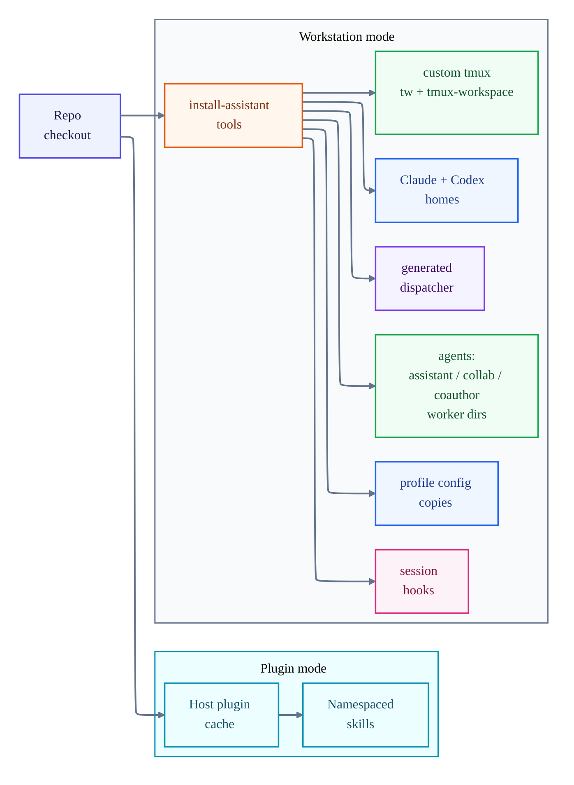
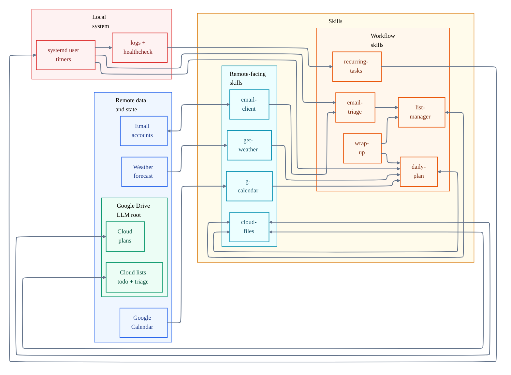
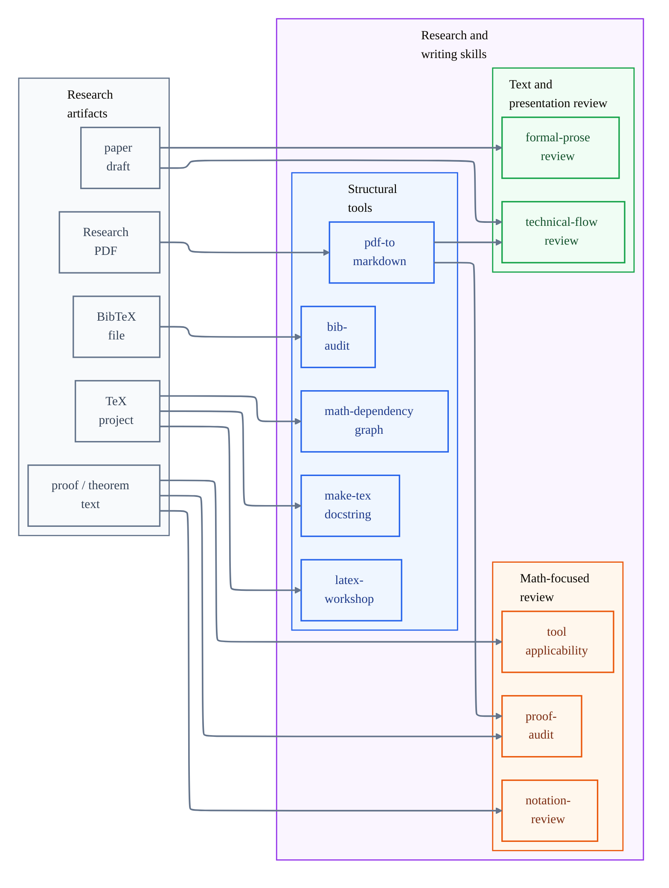
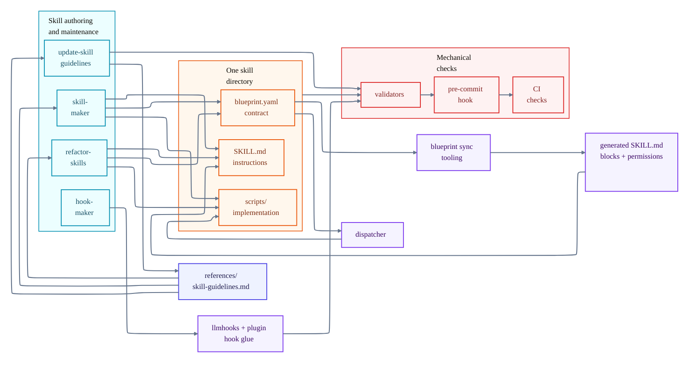

# Famulus

Famulus is a personal and research assistant skillset compatible with both Claude and GPT(here in refered to as the **hosts**). It includes
skills for day-to-day planning, automation, research and writing, auditing and dicomposing complicate math, and skill development.
The repo also ships agent configurations of varying complexities for different tasks.

## Overview

What is included:

- **General assistant skills:** This suite is supposed to play the role of a secratary. It connects to your email, calendar and cloud file system. Each morning, you can ask it to plan your day, it will tell you what you should dress for, fetch you calendar for the day, remind you of the incoming events(birthdays and more), based on your free time suggest on actions from your todo list you can take, and present you with potential actionables from the incoming emails.

- **Research and writing skills:** This suite it meant to help with writing/understanding academic research. It's mostly geared towards math heavy papers. It can check your proofs(much better than llms do out of the box), review the notation, assess applicability of a theorem or tool to the setting, plot the dependency graph of the results, audit the bibliography for hallucinations/newer versions/duplications and review the prose and flow of the document.

- **Workflow skills:** This suite is to improve daily interactions with the llm. It involves git hygiene, modes for different explore vs accuracy trade off, hand-off preperation(making sure all that's learned in the session is written down for future use), and tracing sessions that need hand-off at the end of the day.

- **System and automation skills:** recurring_tasks skill will schedule the scanning emails and making daily plans on systemd and continuously monitors it's health.

- **Skill-development tools:** skill authoring, skill refactoring, guideline
  updates, hook creation, blueprint contracts, dispatcher enforcement, and
  pre-commit validators.
- **Installed command-line tools:** the workstation installer installs
  `assistant`, `collab`, `coauthor`, and `tw`/`tmux-workspace` launchers, plus a
  generated `dispatcher` launcher used for approved skill-to-skill script calls.

The repo is meant to be usable in two ways:

1. **Plugin mode:** install the skillset into Claude Code or Codex as a plugin.
   Skills are namespaced, for example `famulus:proof-audit`.
2. **Workstation mode:** run `install-assistant-tools` to wire one checkout into
   both hosts, install launchers, register hooks, configure shell environment,
   and set up optional Google Drive / Calendar OAuth.

### Runtime map

The diagrams below are Mermaid diagrams. Their source files live under
`graphs/` and are synced into this README with
`python3 graphs/sync-readme-graphs.py`.

<!-- BEGIN GRAPH: graphs/runtime-map.mmd -->

<!-- END GRAPH: graphs/runtime-map.mmd -->

## Install, update, and uninstall

Requirements:

- Python 3.10+ with PyYAML for the repo tooling.
- Git.
- At least one host CLI: Claude Code or Codex.
- Optional, depending on skills used: Google Drive OAuth, Google Calendar OAuth,
  email IMAP/SMTP credentials, `systemd --user`, tmux, rclone, LaTeX tools.

### Option A: install as a plugin

Claude Code:

```text
/plugin marketplace add MoeenNehzati/famulus
/plugin install famulus@nullkit
```

Update:

```text
/plugin update famulus@nullkit
```

Uninstall:

```text
/plugin uninstall famulus@nullkit
```

Codex, using a marketplace snapshot:

```bash
codex plugin marketplace add <marketplace-path-or-url> --json
codex plugin add famulus@<marketplace-name> --json
```

Uninstall through the Codex plugin manager:

```bash
codex plugin remove famulus@<marketplace-name> --json
codex plugin marketplace remove <marketplace-name> --json
```

Plugin installs copy the repo into the host's plugin cache. They do not wire the
local checkout into `~/.claude` or `~/.codex`, and they do not install shell
launchers.

### Option B: install the workstation tools

Use this when you want one local checkout to back both Claude Code and Codex and
when you want the launchers, hooks, profiles, and recurring-task support.

From an environment where the dispatcher is already available, preview the
installer with:

```bash
dispatcher --caller-skill install-assistant-tools install-assistant-tools scripts-install --dry-run
```

On a fresh checkout where the dispatcher is not yet installed, run the same
installer entry point directly:

```bash
python3 skills/install-assistant-tools/scripts/install.py --dry-run
python3 skills/install-assistant-tools/scripts/install.py
```

The installer does the following:

- wires `~/.claude` and `~/.codex` content back to this checkout;
- links shared skills, references, agents, and host context files;
- copies profile config files rather than symlinking them, because hosts may
  write machine-local state into those files;
- installs `assistant`, `collab`, `coauthor`, and `tw`/`tmux-workspace` into a
  bin directory on `PATH`;
- generates a `dispatcher` launcher that runs the repo dispatcher from `$AI`;
- creates worker directories for the installed agents;
- writes a managed shell rc block, or user environment entries on Windows;
- registers session hooks for Claude Code and Codex;
- configures git hooks for the checkout;
- writes the cloud-files config and optionally walks through Google Drive and
  Google Calendar OAuth setup.

Useful installer flags include `--dry-run`, `--no-claude`, `--no-codex`,
`--bin-dir`, `--shell-rc`, `--default-llm claude|codex`, `--home`,
`--claude-home`, and `--codex-home`.

To update a workstation install, pull the repo and rerun the installer. Installed
launchers are symlinks into the checkout, but rerunning the installer refreshes
hooks, profile copies, generated launchers, recurring-task environment files,
and shell setup.

### Workstation uninstall

The uninstall script reverses managed install side effects and prints a
removed/skipped/left/FAILED report:

```bash
python3 skills/install-assistant-tools/scripts/uninstall.py --dry-run
python3 skills/install-assistant-tools/scripts/uninstall.py
```

It removes the managed Codex and Claude hook registrations, unlinks managed
launchers and symlinks, and uses the install manifest when available. OAuth
credentials are left in place unless `--purge` is passed.

## What is included

### Daily assistant loop

Several productivity skills are designed to work together.

- `cloud-files` owns bounded Google Drive transport under the configured LLM
  root. Other skills use it instead of speaking to Drive directly.
- `list-manager` stores structured lists through `cloud-files`, including todo
  and triage lists.
- `email-client` reads and sends mail through configured IMAP/SMTP accounts.
- `email-triage` reads new mail through `email-client`, classifies possible
  actions, and writes concrete actions to `todo` or optional items to `triage`
  through `list-manager`.
- `g-calendar` reads and edits Google Calendar through a local OAuth-backed CLI.
- `get-weather` fetches forecast data for a location and date range.
- `daily-plan` combines calendar, weather, todo, and triage items into a plan
  stored through `cloud-files`.
- `wrap-up` reads the day's plan, asks what was completed, records unplanned
  work, and updates the plan and lists.

Remote objects such as calendars, forecasts, and email accounts live outside
the repo. Cloud lists and cloud plans live under the configured Google Drive LLM
root. The skills fetch from or write to those remote sources. `recurring-tasks`
is one of the skills, but its external integration is the local OS: it writes and
syncs systemd user timers, runs selected skills on a schedule, and reports
through local logs and healthchecks. This scheduled layer is
Linux/systemd-specific; the rest of the repo's framework is tested
cross-platform.

<!-- BEGIN GRAPH: graphs/daily-assistant-loop.mmd -->

<!-- END GRAPH: graphs/daily-assistant-loop.mmd -->

### Research and writing

The research skills are mostly independent tools rather than one tightly coupled
workflow:

<!-- BEGIN GRAPH: graphs/research-writing.mmd -->

<!-- END GRAPH: graphs/research-writing.mmd -->

- `proof-audit` checks mathematical arguments for gaps, hidden assumptions,
  invalid theorem use, and redundancy.
- `tool-applicability` checks whether a theorem, framework, or method actually
  applies in the current setting.
- `notation-review` looks for heavy, inconsistent, or misleading notation and
  proposes a lighter scheme.
- `math-dependency-graph` extracts assumptions, definitions, lemmas, theorems,
  and direct dependency edges from a LaTeX math document.
- `latex-workshop` follows VS Code LaTeX Workshop settings when compiling or
  troubleshooting TeX documents.
- `bib-audit` checks `.bib` files for syntax, style, duplicates, and external
  metadata mismatches.
- `technical-flow-review` reviews document structure, motivation, section
  order, and readability.
- `formal-prose-review` polishes technical prose without changing the math.
- `pdf-to-markdown` converts research PDFs into LLM-readable text.
- `make-tex-docstring` records a TeX document's profile and intended use in a
  top-of-file comment block.

### Skill development framework

The skill-development part of the repo is about keeping skills small and their
coupling explicit.

<!-- BEGIN GRAPH: graphs/skill-development-framework.mmd -->

<!-- END GRAPH: graphs/skill-development-framework.mmd -->

- Each skill has a `blueprint.yaml` contract: category, dependencies, interface
  version, and exported script interfaces.
- Generated blocks in `SKILL.md` expose the relevant contract to the assistant.
- The dispatcher is the only approved route for one skill to call another
  skill's script interface:

  ```bash
  dispatcher --caller-skill <caller> <callee> <interface-id> [args...]
  ```

- Validators reject undeclared dependencies, direct cross-skill script access,
  stale generated artifacts, invalid blueprint structure, host-specific content
  in shared files, and metadata drift.
- `skill-maker` creates or edits skills against the shared guideline.
- `refactor-skills` audits existing skills against that guideline.
- `update-skill-guidelines` keeps guideline edits and validator behavior in
  sync.
- `hook-maker` is for cross-host session hooks: one semantic hook purpose, with
  host-specific bindings handled by the hook framework.

Relevant repo references:

- `references/skill-guidelines.md` — skill-writing standard.
- `references/blueprint/guide.md` and `references/blueprint/template.yaml` —
  blueprint contract reference.
- `script_dispatcher/` — dispatcher implementation.
- `validators/` and `skills/skill-maker/validators/` — commit-time checks.
- `llmhooks/` — host-neutral hook implementations.
- `hooks/` — plugin-mode hook glue.

### Agents and launchers

The installer provides three agent launchers:

- `assistant` — day-to-day personal assistant work.
- `collab` — long project sessions with continuity and handoff behavior.
- `coauthor` — writing-focused sessions.

Each has Claude and Codex profile/config files under `profiles/`, and each gets
a worker directory under `workers/`. `PROFILES.md` is generated from those
profile files and summarizes the differences.

### Full skill list

The table below is generated from `skills/*/blueprint.yaml` and each skill's
`SKILL.md` description by `scripts/generate-skills-table.py`. The pre-commit
hook regenerates it when sources change.

<!-- BEGIN SKILLS TABLE (generated by scripts/generate-skills-table.py) -->
### Productivity

| Skill | What it does |
|---|---|
| `email-client` | Read, search, and send email across configured accounts |
| `email-triage` | Triage the inbox into todo and potential-action lists since the last run |
| `g-calendar` | Read and modify Google Calendar via a local OAuth CLI |
| `get-weather` | Fetch weather for a location, day, or date range |
| `list-manager` | Manage personal YAML lists (todo, shopping, reading, …) in cloud storage |

### Workflow

| Skill | What it does |
|---|---|
| `daily-plan` | Generate today's plan from calendar, todos, and weather |
| `find-handoff-candidates` | You need a mechanical, non-interpretive scan of today's (or another day's) work sessions to find ones that had substantial activity but no … |
| `loose-mode` | Broad, fast exploration mode — breadth over certainty |
| `prepare-handoff` | Prepare a clean handoff: workflow updates, doc updates, residual lessons |
| `tight-mode` | Rigorous, verified output mode — certainty over speed |
| `tool-applicability` | Check whether a theorem or framework achieves a target in the current setting |
| `wrap-up` | End-of-day wrap-up: review the plan, record completions, capture new items |

### Research & Writing

| Skill | What it does |
|---|---|
| `bib-audit` | Audit a `.bib` file for validity, style, external metadata, and duplicates |
| `formal-prose-review` | Polish grammar, tone, and concision in technical prose without touching the math |
| `latex-workshop` | Follow VS Code LaTeX Workshop build behavior for TeX/LaTeX documents |
| `make-tex-docstring` | Create or propose a top-of-document TeX comment block that records the document profile and intended use |
| `math-dependency-graph` | Extract an assumptions-to-results dependency graph from a LaTeX document |
| `notation-review` | Audit and improve mathematical notation for lightness, unification, reuse across scopes, and semantic transparency |
| `proof-audit` | Audit a proof for soundness, coherence, hidden assumptions, and redundancy |
| `technical-flow-review` | Review flow, structure, motivation, and readability of a technical document |

### System & Automation

| Skill | What it does |
|---|---|
| `cloud-files` | Bounded read/write of plain files under a configured Google Drive root |
| `fix-bisync` | Diagnose and repair rclone bisync failures |
| `pdf-to-markdown` | Convert a research-paper PDF into LLM-readable text |
| `recurring-tasks` | Manage AI-driven recurring jobs as systemd user timers, with healthcheck |

### Development

| Skill | What it does |
|---|---|
| `git-workflow` | Branch-safety checks and commit hygiene for any repo |
| `initialize-tdd` | Scaffold a staged, approval-gated TDD project |

### Skill Framework

| Skill | What it does |
|---|---|
| `hook-maker` | Design cross-host assistant hooks: one purpose, per-host bindings |
| `install-assistant-tools` | Install or update launchers, wiring, hooks, and environment on a machine |
| `refactor-skills` | Audit and refactor existing skills against local conventions |
| `skill-maker` | Author new skills that conform to the repo's skill-writing guideline |
| `update-skill-guidelines` | Change the skill-writing standard and its mechanical checks in lockstep |
<!-- END SKILLS TABLE -->

## Repository layout

```text
skills/               one directory per skill
agents/               assistant, collab, and coauthor definitions
profiles/             host profile/config files for those agents
workers/              default local working directories for installed agents
references/           shared standards and blueprint references
script_dispatcher/    dispatcher package used by generated launcher
graphs/               Mermaid diagram sources and README sync script
llmhooks/             cross-host hook implementations and registry
hooks/                plugin-mode hook glue
validators/           repo-wide validators
.githooks/            pre-commit entry point
scripts/              repo maintenance generators
TESTING.md            test-suite notes and known hazards
PROFILES.md           generated profile comparison
```

## Validation and testing

Useful checks:

```bash
python3 graphs/sync-readme-graphs.py --check
python3 validators/runner.py
python3 -m pytest
```

The pre-commit hook runs the validators, gitleaks, and the README/profile
generators. CI runs the validator and install test suites on Linux, macOS, and
Windows with real Claude Code and Codex CLIs where available. See `TESTING.md`
for details.

## License

[MIT](LICENSE).
