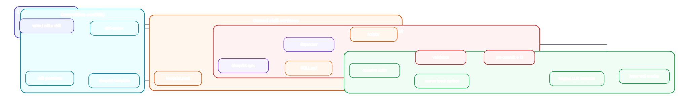
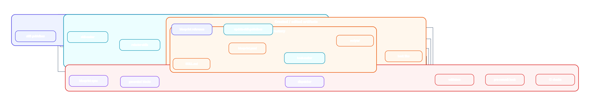
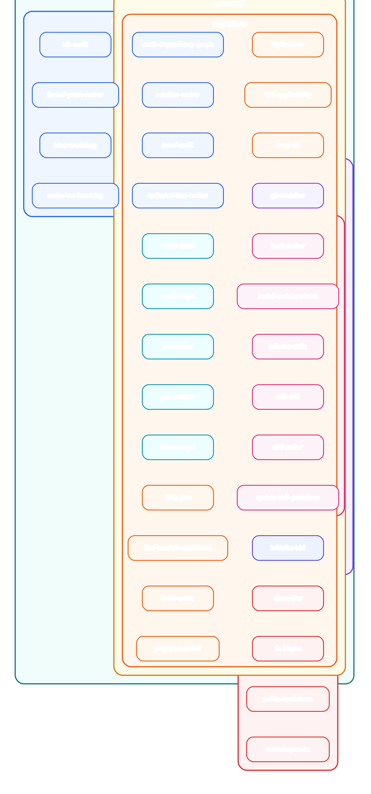

# Maintainer Scaffolding and Blueprint Schema

This document explains the maintainer-facing layer of the repo: the contract
machinery that keeps skills explicit, composable, and checkable.

If you want one entry point, start with [skills/skill-maker/](../../skills/skill-maker/). It owns the
blueprint sync script, most skill-system validators, and the rules that other
skills are expected to follow.

Render a local HTML version with `python3 scripts/generate-previews.py --target scaffolding`.

The core promise: one explicit convention for skills, one mechanical path for enforcing it, and one clearer end state for the assistant as the toolset grows.

## Core pitch

You can sell the core of this system as making your assistant from scratch
easier by forcing a convention that an LLM will not reliably converge to on its
own.

It is not the only good convention. The point is that it is explicit and
machine-evaluable. The repo defines a standard for:

- what a skill does
- what code it relies on
- what systems it touches
- what other skills it touches
- how those touches are allowed to happen

That standard is checked by code, not by the LLM's self-discipline. When the
LLM makes a mistake, the machine can flag it. In this repo that enforcement
happens through generated artifacts, validators, and pre-commit hooks.

The result is a kind of meta-programming for LLMs: you are not only asking the
model to write skills, you are also giving it an external structure that keeps
those skills cohesive, limits what they can see and touch, and reduces overlap
between tools.

## Responsibility map

As the repo explains its parts, each part should be tied to an end goal:

| Part | Responsible for | End goal |
|---|---|---|
| `SKILL.md` | trigger conditions, usage guidance, owned responsibility | cohesive skills |
| `blueprint.yaml` | dependencies, interfaces, permissions hints, cross-skill boundaries | explicit touch surface |
| `scripts/` | concrete behavior behind the skill contract | implementation without leaking boundaries |
| blueprint sync | generated compatibility artifacts that stay aligned with the blueprint | one canonical contract source |
| `dispatcher` / `script_dispatcher` | allowed cross-skill script invocation only | narrow, predictable composition |
| validators | boundary checks, schema checks, sync checks, metadata checks | machine-flagged LLM mistakes |
| pre-commit and CI | enforcement before merge and after push | convention that actually holds over time |

## Structure at a glance

This graph is the structural overview. The sections below unpack what each part owns and which end goal it protects.

## 1. The authored contract

This layer is what the LLM writes directly. It should stay small, explicit, and
owned by the skill.

Each skill has three authored surfaces:

1. `SKILL.md` says when the skill applies and how to use it.
2. `blueprint.yaml` says what the skill is allowed to depend on and export.
3. `scripts/`, tests, schemas, and references implement the behavior.

Responsibilities in this layer:

- `SKILL.md`
  - Responsible for keeping the skill cohesive around one function and making
    invocation understandable to the model.
- `blueprint.yaml`
  - Responsible for making dependencies, interfaces, permissions hints, and
    cross-skill boundaries explicit.
- `scripts/`
  - Responsible for holding the real logic so the skill contract is not mixed
    with ad hoc code in prose.

The scaffolding exists to keep these three surfaces aligned.

## Canonical files

- [skills/skill-maker/SKILL.md](../../skills/skill-maker/SKILL.md)
  - The maintainer entry point for creating or editing skills.
- [references/skill-guidelines.md](../../references/skill-guidelines.md)
  - Repo-wide skill authoring rules.
- [references/blueprint/template.yaml](../../references/blueprint/template.yaml)
  - The comment-rich starting point for new `blueprint.yaml` files.
- [references/blueprint/schema.json](../../references/blueprint/schema.json)
  - The formal schema for individual blueprints.
- [references/blueprint/guide.md](../../references/blueprint/guide.md)
  - The narrative guide to the schema, patterns, and validation model.
- [references/blueprint/README.md](../../references/blueprint/README.md)
  - Short index into the blueprint reference set.

## 2. The canonical source and generated views

Hand-authored:

- `skills/<name>/SKILL.md`
- `skills/<name>/blueprint.yaml`
- the skill's implementation files

Generated from `blueprint.yaml`:

- `skills/<name>/depends_on_skills`
- `skills/<name>/permissions.json`
- the contract block near the top of `SKILL.md`
- the owner-facing interface block in `SKILL.md`

[skills/skill-maker/scripts/sync_skill_blueprints.py](../../skills/skill-maker/scripts/sync_skill_blueprints.py) is the sync boundary
between the authored blueprint and those compatibility artifacts. Do not edit
generated blocks by hand.

This part is responsible for one end goal in particular: there should be one
canonical contract source, not several drifting copies.

## 3. The boundary specification

The checked-in schema is in [references/blueprint/schema.json](../../references/blueprint/schema.json).

At the top level, the live blueprint contract currently covers:

- `category`
- `interface_version`
- `cross_platform`
- `depends_on`
- `skill_interface`
- `suggested_permissions`
- `script_interfaces`

`category` is still the live classification field. The checked-in schema does
not currently define top-level `role` or `kind` fields.

The most important high-friction part is `script_interfaces`, because that is
where the repo makes script boundaries explicit. Each interface group declares:

- the owner-facing default `id`
- the shared `command`
- optional `description` and `usage` for the generated `SKILL.md` block
- an optional `default` subinterface for the owner-facing surface
- optional named `subinterfaces` for narrower external caller views
- `patterns` that constrain valid argv/stdin forms
- `allow_all_skills` and `allowed_callers` access rules

That is the contract the dispatcher enforces at runtime. This part is
responsible for making it mechanically clear what a skill may touch and how it
may touch it.

## 4. The runtime boundary

Cross-skill script calls are not supposed to reach into another skill's
`scripts/` directory directly.

The intended runtime path is:

1. A caller declares a dependency in its `blueprint.yaml`.
2. The caller invokes `dispatcher --caller-skill ...` or
   `script_dispatcher.dispatch(...)`.
3. [script_dispatcher/src/script_dispatcher/core.py](../../script_dispatcher/src/script_dispatcher/core.py) loads the callee's
   `blueprint.yaml`.
4. The dispatcher resolves the requested interface id, checks dependency and
   caller permissions, matches the invocation against declared patterns, and
   executes the command in the declared working directory.

This is why the blueprint is more than documentation. It is the runtime policy
surface for local script composition. This part is responsible for narrow,
predictable composition rather than ad hoc reach-through between skills.

## 5. The enforcement path

The repo has two main validation layers.

Schema layer:

- [references/blueprint/schema.json](../../references/blueprint/schema.json) validates the structure of each blueprint.

Relationship and boundary layer:

- `skills/skill-maker/validators/*.py` validates dependency declarations,
  interface-id uniqueness, boundary rules, dispatcher usage, generated block
  layout, and other skill-system invariants.
- [`validators/*.py`](../../validators/) handles repo-wide checks outside the skill contract itself.

[validators/runner.py](../../validators/runner.py) discovers validators from both packages and runs them
against a git-tracked mirror of the repo, so validators see staged content
without being confused by untracked local scratch files.

The key claim here is that the standard is evaluated by machine, not by trusting
the LLM to remember the convention correctly. This layer is responsible for
flagging mistakes before they become the new normal.

## 6. Why this reduces overlap

The skill taxonomy is one visible outcome of the scaffolding discipline: a toolset that stays partitioned enough for the LLM to choose among skills without every tool collapsing into the same fuzzy surface.

Because skills are pushed toward one owned job, one declared boundary, and one
explicit interface surface, the toolset becomes easier for the model to invoke:

- skills overlap less
- each skill sees less
- cross-skill calls are narrower
- ambiguous "everything tool" behavior is harder to smuggle in

This is one of the practical senses in which the repo is doing
"meta-programming for LLMs".

## 7. Why `skill-maker` is the entry point

`skill-maker` is where the system is easiest to understand from the inside:

- its [SKILL.md](../../skills/skill-maker/SKILL.md) points directly at [references/skill-guidelines.md](../../references/skill-guidelines.md)
- its [`validators/`](../../skills/skill-maker/validators/) directory is the main skill-system enforcement surface
- its [scripts/sync_skill_blueprints.py](../../skills/skill-maker/scripts/sync_skill_blueprints.py) shows what the blueprint generates
- its tests exercise the blueprint tooling itself

If you are trying to understand "how does this repo scaffold skills?", that
directory is the shortest path to the answer.

## 8. Safe change routes

If you are changing a skill:

1. Start from `references/blueprint/template.yaml`.
2. Edit the skill's `blueprint.yaml`.
3. Sync generated artifacts with
   `skills/skill-maker/scripts/sync_skill_blueprints.py`.
4. Run the relevant validators and tests.

If you are changing the schema or scaffolding:

1. Update `references/blueprint/schema.json`.
2. Update `references/blueprint/template.yaml`.
3. Update `references/blueprint/guide.md`.
4. Update `references/skill-guidelines.md` if the authoring rules changed.
5. Update any affected validators under `skills/skill-maker/validators/`.
6. Rerun sync and validation so the generated artifacts and docs stay aligned.

## 9. Related surfaces

- `README.md`
  - High-level package overview, including the maintainer-facing section.
- [README.md](../../README.md)
  - High-level package overview, including the maintainer-facing section.
- [script_dispatcher/](../../script_dispatcher/)
  - Runtime implementation of blueprint-based script invocation.
- [validators/](../../validators/)
  - Repo-wide checks.
- [llmhooks/](../../llmhooks/) and [hooks/](../../hooks/)
  - Hook scaffolding and plugin glue.
- [skills/refactor-skills/](../../skills/refactor-skills/)
  - Audits existing skills against the shared rules.
- [skills/update-skill-guidelines/](../../skills/update-skill-guidelines/)
  - Changes the guideline and validator expectations together.
