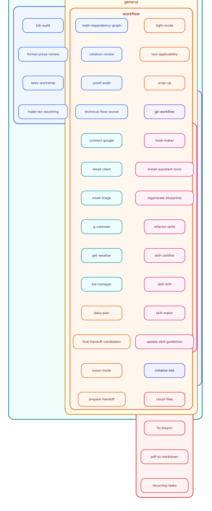

# Skill Index

> Generated from live blueprints and `SKILL.md` descriptions. Do not edit by hand.

This page is the complete skill inventory. For walkthroughs and examples, start from the user docs or contributor docs linked from [README.md](../README.md).

The graph gives a visual overview of the live skill set. The sections below are the complete text inventory.

## Personal Assistance

### Featured

- `daily-plan` — Generate today's plan from calendar, todos, and weather _(topics: planning, personal-organization; activated by: user request, skill workflow)_
- `email-client` — Read, search, and send email across configured accounts _(topics: communications, external-integrations; activated by: user request, skill workflow)_
- `email-triage` — Triage the inbox into todo and triage lists since the last run _(topics: communications, personal-organization; activated by: user request, skill workflow)_
- `g-calendar` — Read and modify Google Calendar via a local OAuth CLI _(topics: planning, personal-organization, external-integrations; activated by: user request, skill workflow)_
- `get-weather` — Fetch weather for a location, day, or date range _(topics: planning, external-integrations; activated by: user request, skill workflow)_
- `list-manager` — Manage personal YAML lists in cloud storage _(topics: personal-organization, storage-and-sync; activated by: user request, skill workflow)_
- `wrap-up` — Review the day, record completions, and capture follow-up items _(topics: planning, personal-organization, session-management; activated by: user request, skill workflow)_

## Research

### Featured

- `bib-audit` — Audit a `.bib` file for validity, style, external metadata, and duplicates _(topics: scholarly-documents, research-writing; activated by: user request, skill workflow)_
- `formal-prose-review` — Polish grammar, tone, and concision in technical prose without touching the math _(topics: research-writing, scholarly-documents; activated by: user request, skill workflow)_
- `latex-workshop` — Follow VS Code LaTeX Workshop build behavior for TeX/LaTeX documents _(topics: scholarly-documents, research-writing; activated by: user request, skill workflow)_
- `math-dependency-graph` — Extract an assumptions-to-results dependency graph from a LaTeX document _(topics: mathematical-reasoning, visualization, scholarly-documents; activated by: user request, skill workflow)_
- `notation-review` — Mathematical notation needs review for lightness, unification, reuse across scopes, or semantic transparency _(topics: mathematical-reasoning, research-writing; activated by: user request, skill workflow)_
- `proof-audit` — Audit a proof for soundness, coherence, hidden assumptions, and redundancy _(topics: mathematical-reasoning, research-writing, scholarly-documents; activated by: user request, skill workflow)_
- `technical-flow-review` — A technical document needs review for flow, structure, motivation, or readability _(topics: research-writing, scholarly-documents; activated by: user request, skill workflow)_
- `tool-applicability` — Check whether a theorem or framework achieves a target in the current setting _(topics: mathematical-reasoning; activated by: user request, skill workflow)_

### Listed

- `make-tex-docstring` — Create or propose a top-of-document TeX comment block that records the document profile and intended use _(topics: scholarly-documents, research-writing; activated by: user request, skill workflow)_
- `pdf-to-markdown` — Convert a research-paper PDF into LLM-readable text _(topics: scholarly-documents; activated by: user request, skill workflow)_

## Software Development

### Listed

- `git-workflow` — Branch-safety checks and commit hygiene for any repo _(topics: repository-workflow; activated by: user request, skill workflow)_
- `initialize-tdd` — Scaffold a staged, approval-gated TDD project _(topics: repository-workflow, assistant-assurance; activated by: user request)_

## Assistant Development

### Featured

- `refactor-node` — Refactor whole repository nodes or owned sub-scopes by gateway language _(topics: assistant-authoring, assistant-architecture, assistant-assurance, repository-workflow; activated by: user request, skill workflow)_
- `skill-maker` — Author new skills that conform to the repo's skill-writing guideline _(topics: assistant-authoring, assistant-architecture, assistant-assurance, repository-workflow; activated by: user request, skill workflow)_

### Listed

- `hook-maker` — Design cross-host assistant hooks with one purpose and per-host bindings _(topics: assistant-authoring, assistant-architecture; activated by: user request, skill workflow)_
- `regenerate-blueprints` — An existing skill's blueprint.yaml needs regeneration or refresh _(topics: assistant-authoring, assistant-architecture; activated by: user request, skill workflow)_
- `skill-certifier` — Mechanical checks and semantic review should issue fresh node certificates for an exact committed repository state _(topics: assistant-assurance, assistant-architecture; activated by: user request, skill workflow)_
- `skill-drift` — Reading signed certificate currentness or canonical node hashes for Famulus modules _(topics: assistant-assurance, assistant-architecture; activated by: user request, skill workflow)_
- `update-standards` — Change canonical standards and keep their pinned closures aligned _(topics: assistant-authoring, assistant-architecture, assistant-assurance; activated by: user request, skill workflow)_

## Assistant Operations

### Featured

- `recurring-tasks` — Manage recurring AI jobs through the host's native per-user scheduler _(topics: task-automation, system-maintenance; activated by: user request, skill workflow, scheduled job)_

### Listed

- `cloud-files` — Bounded read/write of plain files under a configured Google Drive root _(topics: external-integrations, storage-and-sync; activated by: user request, skill workflow)_
- `connect-google` — A Google service needs a shared OAuth client prepared, or when the user asks to prepare Google authentication for Famulus _(topics: external-integrations; activated by: user request, skill workflow)_
- `fix-bisync` — Diagnose and repair rclone bisync failures _(topics: storage-and-sync, system-maintenance; activated by: user request)_
- `install-assistant-tools` — Install or update launchers, wiring, hooks, and environment on a machine _(topics: assistant-installation, system-maintenance; activated by: user request)_

## Assistant Interaction

### Featured

- `loose-mode` — Broad, fast exploration mode with breadth over certainty _(topics: reasoning-control; activated by: user request; persistent modifier)_
- `tight-mode` — Rigorous, verified output mode with certainty over speed _(topics: reasoning-control; activated by: user request; persistent modifier)_

### Listed

- `llm-wakeup` — Schedule a supported assistant session after a usage reset, infer a wakeup from a timeout, or manage per-session automatic wakeups _(topics: session-management, task-automation; activated by: user request, skill workflow, scheduled job)_
- `prepare-handoff` — Prepare a clean handoff with workflow and documentation updates _(topics: session-management, repository-workflow; activated by: user request, skill workflow)_
